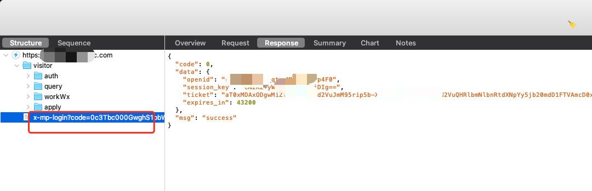
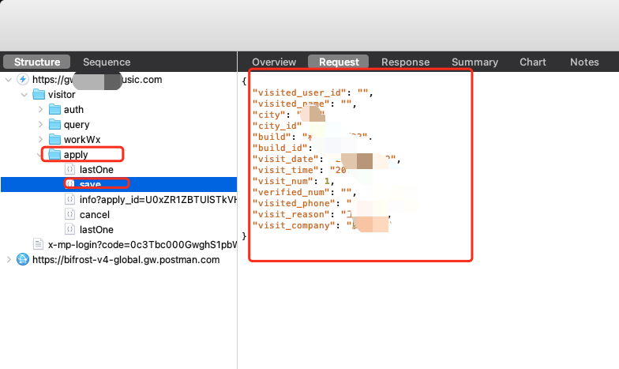
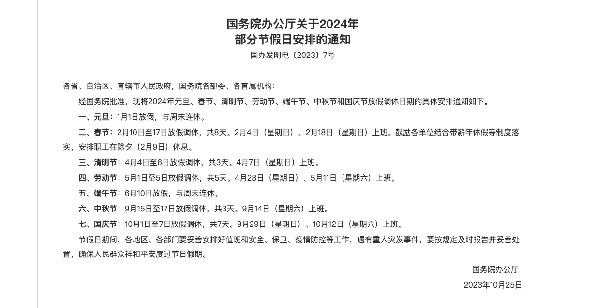
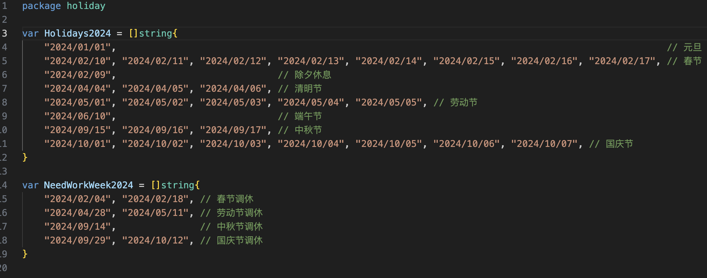
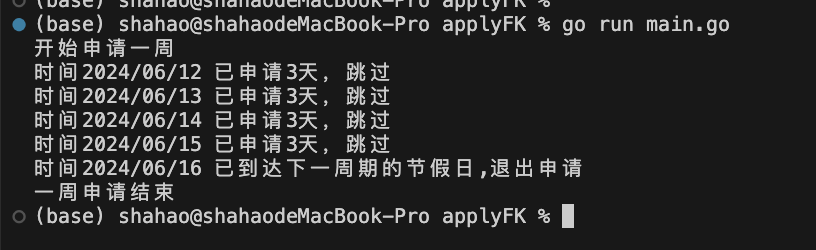

## 背景
在某厂上班，因公司规章制要求，非本公司员工到公司办公室办公需要申请访客码，每进一次刷一次二维码。然后访客码的申请需要填写的内容太过麻烦了

需要填写被访者的电话、访客姓名、访问地址、楼栋信息、申请理由、公司名称等等信息，差不多一次填写需要1分钟吧，申请完就等领导审批。


我一般早上进去一次，中午出来吃饭还要进去一次，晚上基本加班还要再扫一下，所以一天下来要刷3次，一周就是15次，要申请访客码的工作量可想而知，主要是申请繁琐，效率低下。想着能不能写个脚本一键申请，省去重复性劳动，提高工作效率。
## 思考过程
我是通过微信小程序进行申请的，然后访客码的申请应该有相关的接口，可以通过Charles抓包抓到相关的接口，然后模拟发送请求，获取到返回的结果，然后根据返回的结果进行填写。

要想请求接口，那接口肯定是需要鉴权的，比如token，所以需要先获取token，然后在请求接口时带上token。

获取token的方法有很多，比如通过抓包获取，或者通过登录获取。

抓包获取token的方法就是使用Charles抓包工具，在登录页面，找到登录接口的请求，然后在请求头中找到token，复制到代码中。



果然，通过上面这种方法，我成功获取到了token。

然后就是要找到申请的接口，然后模拟发送请求，获取到返回的结果，然后根据返回的结果进行填写。


很快我找到了申请访客码的接口，可以看到它的请求参数、请求内容



那到接口和参数后，就可以想想自己的使用场景和需求了。

## 需求整理
我现在是两个月都要在那办公，但一次申请一个月怕被领导发现，所以我打算一次申请一周的访客码，只需要一周跑一次脚本，可以周日跑，然后领导批量审批一次就好了。
那么问题来了，有时候是遇到节假日调班，“周末”还需要上班，“工作日”然而放假。那么我该如何处理呢？

我想到的一种方案：就是从[国务院](https://www.gov.cn/zhengce/content/202310/content_6911527.htm)拿到2024年节假日，然后在判断申请日期是否是在这些节假日中，如果是，就不申请访客码。如果是需要上班的周末，就申请访客码。




然后将文字放给ChatGPT,帮我转出golang的枚举变量就好了



然后我又通过抓包发现可以获取到我本人当前的申请记录，想着添加一个判断，如果今天已经申请过了，就不再申请。如果一天申请不到3次就继续申请。


## 脚本编写

大致的逻辑就是：
1. 获取token
2. 创建请求对象，设置结构体参数、请求令牌（token）
3. 获取当前申请记录，得到最近的申请时间和次数
4. 判断是否已经申请过，如果已经申请过，则不再申请
5. 如果今天还可以申请，则发送请求，获取返回结果


### 代码实现
主程序main.go
```
package main

import (
	"applyFK/visit"
)

var token string = "xx-kvC5wGQkUC9sFs87eA"
var ticket string = "xx-xx" // 申请的ticket

func main() {
	// 获取访问的token和ticket
	v := visit.NewApply()

	v.SetToken(token)
	v.SetTicket(ticket)

	// 申请一周内的访客码，自动规避节假日和法定节假日；
	// 如果今天是假期则自动调整日期到最近的工作日；
	// 如果今天是工作日则判断是否已经申请过访客码，如果已经申请过则不再申请；
	v.ApplyOneWeek()

	// 申请制定日期的访客码和次数，默认1人
	// v.ApplyDate("2024/01/01", 1)

	// 申请多人的访客码则
	// v.SetApplyNum(2)
	// v.ApplyDate("2024/01/01", 1)

	// 修改访问人的电话
	// v.SetAppliedPhone("135xxxxxxxxx")
	// v.ApplyDate("2024/01/01", 1)

}

```
visit/visit.go

```
package visit

import (
	"bytes"
	"encoding/json"
	"fmt"
	"io"
	"net/http"
)

type Apply struct {
	Token  string      `json:"token"`
	Ticket string      `json:"ticket"`
	Body   ApplyRecord `json:"body"`
}
type ApplyRecord struct {
	AppliedUserID string `json:"visited_user_id"` // 被访问者的 ID
	AppliedName   string `json:"visited_name"`    // 被访问者的姓名
	City          string `json:"city"`            // 访问者所在城市
	CityID        int    `json:"city_id"`         // 访问者所在城市 ID
	Build         string `json:"build"`           // 访问者所在楼栋
	BuildID       int    `json:"build_id"`        // 访问者所在楼栋 ID
	ApplyDate     string `json:"visit_date"`      // 这里假设日期格式为 YYYY/MM/DD
	ApplyTime     string `json:"visit_time"`      // 这里假设时间格式为 HH:MM
	ApplyNum      int    `json:"visit_num"`       // 访问次数
	VerifiedNum   string `json:"verified_num"`    //	被验证次数
	AppliedPhone  string `json:"visited_phone"`   // 被访问者的手机号
	ApplyReason   string `json:"visit_reason"`    // 访问原因
	ApplyCompany  string `json:"visit_company"`   // 访问公司
}

func NewApply() *Apply {
	return &Apply{
        // 这里对数据进行敏感处理，请勿直接使用
		Body: ApplyRecord{
			City:         "xx",
			CityID:       28,
			Build:        "xx",
			BuildID:      53,
			ApplyTime:    "09:00",
			ApplyNum:     1,
			ApplyReason:  "xx",
			ApplyCompany: "xx",
			AppliedPhone: "xx", // 假设被访问者的手机号为xxx
		},
	}
}

func (v *Apply) Apply() error {
	fmt.Printf("开始申请%s访客码\n", v.Body.ApplyDate)
	jsonValue, _ := json.Marshal(v.Body)
	payload := bytes.NewBuffer(jsonValue)

	// 替换以下URL为您要发送POST请求的服务器地址
	url := "https://xxxxx/visitor/apply/save" // 这里假设申请访客码的接口地址

	// 创建请求
	req, err := http.NewRequest("POST", url, payload)
	if err != nil {
		fmt.Println(err)
		return err
	}

	// 设置请求头
	req.Header.Add("Content-Type", "application/json")
	req.Header.Add("user-agent", "Mozilla/5.0 (iPhone; CPU iPhone OS 11_3 like Mac OS X) AppleWebKit/605.1.15 (KHTML, like Gecko) Mobile/15E217 MicroMessenger/6.8.0(0x16080000) NetType/WIFI Language/en Branch/Br_trunk MiniProgramEnv/Mac")
	req.Header.Add("access-token", v.Token)
	req.Header.Add("x-mgw-ticket", v.Ticket)
	// 发送请求
	client := &http.Client{}
	resp, err := client.Do(req)
	if err != nil {
		fmt.Println(err)
		return err
	}
	defer resp.Body.Close()

	// 打印响应状态码
	fmt.Printf("申请成功\n")
	// 打印响应体
	body, _ := io.ReadAll(resp.Body)
	fmt.Println("Response Body:", string(body))
	return nil
}

func (v *Apply) SetToken(token string) {
	v.Token = token
}
func (v *Apply) SetTicket(ticket string) {
	v.Ticket = ticket
}
func (v *Apply) SetAppliedUserID(userID string) {
	v.Body.AppliedUserID = userID
}

func (v *Apply) SetAppliedName(name string) {
	v.Body.AppliedName = name
}

func (v *Apply) SetCity(city string) {
	v.Body.City = city
}

func (v *Apply) SetCityID(cityID int) {
	v.Body.CityID = cityID
}

func (v *Apply) SetBuild(build string) {
	v.Body.Build = build
}

func (v *Apply) SetBuildID(buildID int) {
	v.Body.BuildID = buildID
}

func (v *Apply) SetApplyDate(date string) {
	v.Body.ApplyDate = date
}

func (v *Apply) SetApplyTime(time string) {
	v.Body.ApplyTime = time
}

func (v *Apply) SetApplyNum(num int) {
	v.Body.ApplyNum = num
}

func (v *Apply) SetVerifiedNum(num string) {
	v.Body.VerifiedNum = num
}

func (v *Apply) SetAppliedPhone(phone string) {
	v.Body.AppliedPhone = phone
}

func (v *Apply) SetApplyReason(reason string) {
	v.Body.ApplyReason = reason
}

func (v *Apply) SetApplyCompany(company string) {
	v.Body.ApplyCompany = company
}


```

申请的方法visit/apply.go

```
package visit

import (
	"applyFK/holiday"
	"fmt"
)

func (v *Apply) ApplyOneWeek() error {
	fmt.Println("开始申请一周")
	hadApplyDays, err := v.GetHadApplyDays() // 获取已申请天数
	if err != nil {
		fmt.Printf("获取已申请天数失败%s", err)
		return err
	}
	firstWorkDay := false
	for i := 0; i < 30; i++ { // 限制30天循环申请
		currentDate := holiday.CurrentDayStr(i)
		applyDays := 3 // 每天申请3次
		if _, ok := hadApplyDays[currentDate]; ok {
			days := hadApplyDays[currentDate]
			if days >= 3 {
				firstWorkDay = true
				fmt.Printf("时间%s 已申请3天，跳过\n", currentDate)
				continue
			}
			applyDays = 3 - days
			fmt.Printf("时间%s 已申请%d次,还需要%d次\n", currentDate, days, applyDays)
		}
		isHoliday := holiday.IsHoliday(currentDate)
		if firstWorkDay && isHoliday {
			fmt.Printf("时间%s 已到达下一周期的节假日,退出申请\n", currentDate)
			break
		} else if isHoliday {
			fmt.Printf("时间%s 跳过当前周期的节假日\n", currentDate)
			continue
		}
		fmt.Printf("时间%s 开始申请\n", currentDate)
		err = v.ApplyDate(currentDate, applyDays)
		if err != nil {
			return err
		}
		firstWorkDay = true
	}
	fmt.Println("一周申请结束")
	return nil
}

```

## 运行结果


## 总结
通过以上脚本，我成功实现了一次申请一周的访客码，并且自动规避节假日和法定节假日，并且判断是否已经申请过访客码，如果已经申请过则不再申请。

当然，脚本还有很多可以优化的地方，这里只是抛砖引玉，希望能给大家提供一些思路。